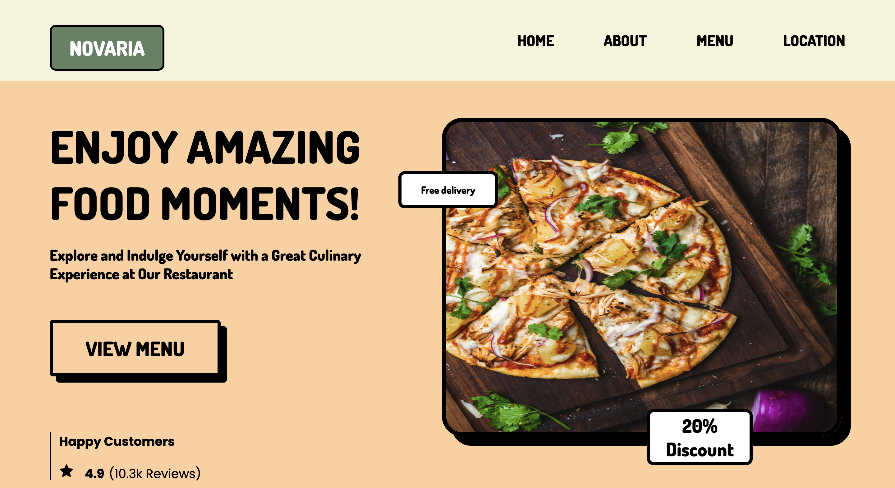

# Novaria | Restaurant Website

**Novaria** is a sophisticated restaurant website designed to provide an exceptional user experience. The website consists of several pages, each meticulously crafted using **HTML** and **CSS** to ensure both functionality and aesthetic appeal.

## Features of Novaria

- **Home Page**:

  - Welcomes visitors with an elegant design and an overview of the restaurant's ambiance.
  - High-quality images and a brief introduction to the restaurant's values.

- **About Page**:

  - A dedicated page to share the restaurant’s story, mission, and vision.

- **Menu Page**:

  - A comprehensive and visually appealing display of the restaurant's diverse menu.
  - High-resolution images of each dish, making it easy for customers to decide on their choices.

- **Location Page**:
  - Essential contact information including address and phone number.

## Technical Details

- **HTML**:

  - Structured and semantic HTML5 elements to enhance the website's accessibility and SEO.
  - Proper use of tags to create a logical flow of content.

- **CSS**:
  - Custom styles to provide a unique and attractive look and feel.
  - Utilization of modern CSS techniques like Flexbox and Grid for a structured layout.
  - CSS animations and transitions to add subtle interactive elements.

## Current Limitations

- **Responsiveness**:
  - The website is currently not optimized for all devices.
  - Future updates will include making the design responsive to ensure it looks and functions perfectly on all devices, from desktops to mobile phones.

## Why Choose Novaria

- **User Experience**: Focused on providing a seamless and enjoyable browsing experience with easy navigation and fast load times.
- **Aesthetic Design**: Beautifully designed with a balance of functionality and visual appeal to attract and retain visitors.

---

Visit **Novaria** to explore a culinary journey that combines exquisite flavors with a delightful dining experience.
